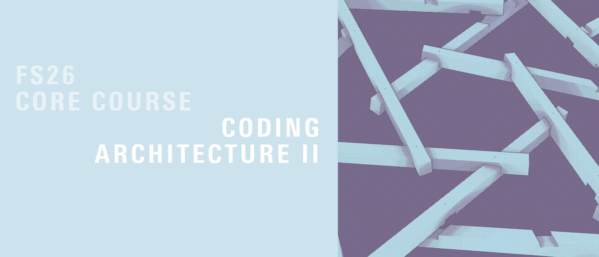
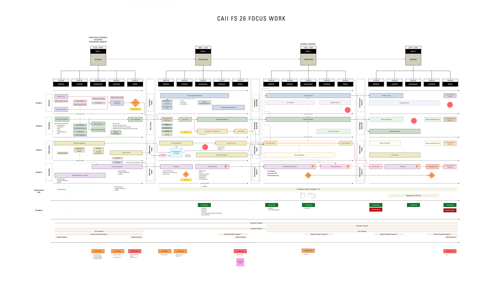
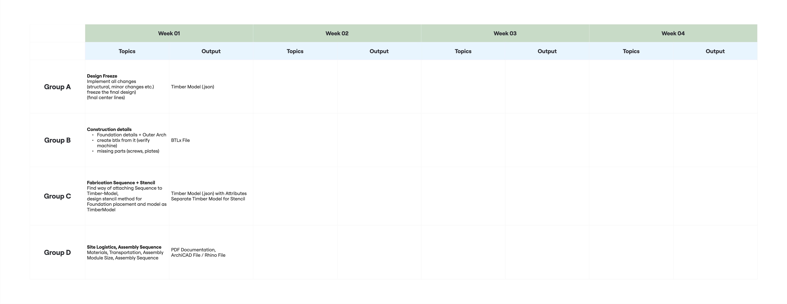

# Coding Architecture II: Focus Work

Welcome to the **Focus Work** of Coding Architecture II, Spring Semester 2026! 

Following an intensive design phase, this repository focuses on the translation of the **winning project** into a real-world, full-scale timber structure. Over the next four weeks, we will adapt, refine, fabricate, and assemble the reciprocal frame structure for the local neighborhood garden (*Quartiergarten*).

This phase bridges the gap between computational design and physical reality, requiring a fabrication- and assembly-aware mindset from day one.

## Table of Contents
1. [Focuswork Overview & Schedule](#️-semester-overview--schedule)
   - [Week 1: Revision & Detailing](#week-1-revision--detailing)
   - [Week 2: Preparation & Machine Instructions](#week-2-preparation--machine-instructions)
   - [Week 3: Fabrication & Prefabrication](#week-3-fabrication--prefabrication)
   - [Week 4: On-Site Assembly](#week-4-on-site-assembly)
2. [Workflow & Team Structure](#-workflow--team-structure)
   - [Dynamic Deliverables](#dynamic-deliverables)
3. [Repository Structure](#️-repository-structure)
   - [Working Folders vs. Deliverables](#working-folders-vs-deliverables)
   - [Group 3's Approach and changes to the repo](#-the-winning-project-group-3s-approach)

---

## Focuswork Overview & Schedule



The Focus Work spans exactly 4 weeks (20 full working days), taking us from design refinement all the way to the final construction and Apero.

### Week 1: Revision & Detailing
**Goal: Design Freeze, Timber Model & BTLX Extraction**
* Integrate direct feedback and wishes from the *Quartiergarten* community.
* Resolve structural analysis and finalize construction details (foundations, connections, joints).
* Establish the fabrication and assembly sequence, including site planning and logistics.
* Design the physical template (*Schablone*) for pinpoint foundation placement.

### Week 2: Preparation & Machine Instructions
**Goal: System Ready for Fabrication**
* Prepare the CNC machine instructions and dive into the HOPS file format.
* Pre-cut all raw beams to their required stock length.
* Finalize the modular subdivision of the structure.
* Plan exact sequences, define transport logistics, and order the final remaining parts.

### Week 3: Fabrication & Prefabrication
**Goal: Transport-Ready Modules**
* Produce the foundation template and machine all custom timber parts.
* Assemble the parts into pre-fabricated modules simultaneously in the lab.
* Label all elements systematically and pack them to be transport-ready.

### Week 4: On-Site Assembly
**Goal: Full-Scale Construction**
* Transport all modules to the site.
* Use the template for accurate foundation placement.
* Assemble the modules into the final structure in a single day using a crane.
* Site teardown, tool cleanup, and concluding with a well-deserved Apero! 🍻

---

## Workflow & Team Structure



> *Note: This image will be updated soon.*

The cohort is divided into **4 Groups (A, B, C, D)**. 

To foster leadership and project management skills, **each group takes the primary responsibility for one specific week**, coordinating the tasks and ensuring the milestones are met.
    
### Dynamic Deliverables
Weekly deliverables will be announced on a rolling basis. The workflow will adapt to the reality of the project: sometimes it will be linear, sometimes circular and iterative. There will be highly intense periods and more relaxed ones. **Flexibility, communication, and teamwork are our most important tools.**

You will work across the organized sub-directories (`group_a/`, `group_b/`, `group_c/`, `group_d/`) and will heavily interact and hand off tasks between groups.


## Repository Structure

To keep the repository organized despite the dynamic and sometimes chaotic nature of the Focus Work, we strictly separate **work in progress** from **official milestones**. 

```text
coding_architecture_fs26_focus_work/
├── code/                # Core Python scripts and GH definitions
├── design/              # Rhino files and base geometries
├── deliverables/        # Official weekly handovers
│   ├── Week_01/
│   ├── Week_02/
│   └── ...
├── group_a/             # Working directory for Group A
├── group_b/             # Working directory for Group B
├── group_c/             # Working directory for Group C
└── group_d/             # Working directory for Group D
```

### Working Folders vs. Deliverables
* **`group_*/` Folders:** Your primary sandbox. This is where your group edits scripts, tests parametric components, experiments with new tools, and saves intermediate Grasshopper files. Each group has full ownership over their folder.
* **`deliverables/Week_XX/` Folders:** At the end of each week, the responsible lead group compiles the finalized code, the frozen Rhino models, fabrication files (like BTLX/HOPS), and logistic lists into the respective week's folder. This guarantees a clean, linear history of our progress without the clutter of daily work.
* **`code/` & `design/`:** Shared global resources. The `code/` folder contains the core algorithmic pipeline that we refine together.

### Group 3's Approach and changes to the default solution
The codebase provided here is based on the winning design from the semester. Group 3 distinguished themselves by heavily extending our standard reciprocal frame template to bridge the gap between automated generation and manual control. Here is how their approach stands out and which files drive it:
    
1. **Dual-Mesh Generation:** Instead of applying one algorithm to the whole structure, they generate a hexagonal mesh for the interior beams and a quad mesh for the boundary beams.
2. **Custom RF Logic (`a03_rf_system_timo.py`):** They authored custom reciprocal frame logic for the inner beams to introduce specifically tailored hexagonal eccentricity and beam extensions, while keeping the boundary beams simple (`a03_rf_system.py`).
3. **Interactive Line Editing (C# Component):** They merged the beams (`a03_line_cleaner.py`), extracted the pure centerlines, and passed them into a custom C# Grasshopper component. This script creates an interactive GUI in Rhino (with custom Snaps and a mini-Gumball) that allows developers to manually drag and adjust specific beam endpoints visually.
4. **The Hybrid System (`a03_rf_system_hybrid.py`):** Because moving independent lines manually breaks the original continuous mesh topology, they wrote a script that intelligently pieces the edited loose lines back together into a valid, combined `RFSystemHybrid` mesh graph.
5. **Custom Foundation Rules:** By subclassing the default timber model creator, we have started to implemented specific rules to automatically identify foundation beams (beams lying horizontally near `z=0`), assign them a stronger 110x120 cross-section, and apply specific structural joints.
