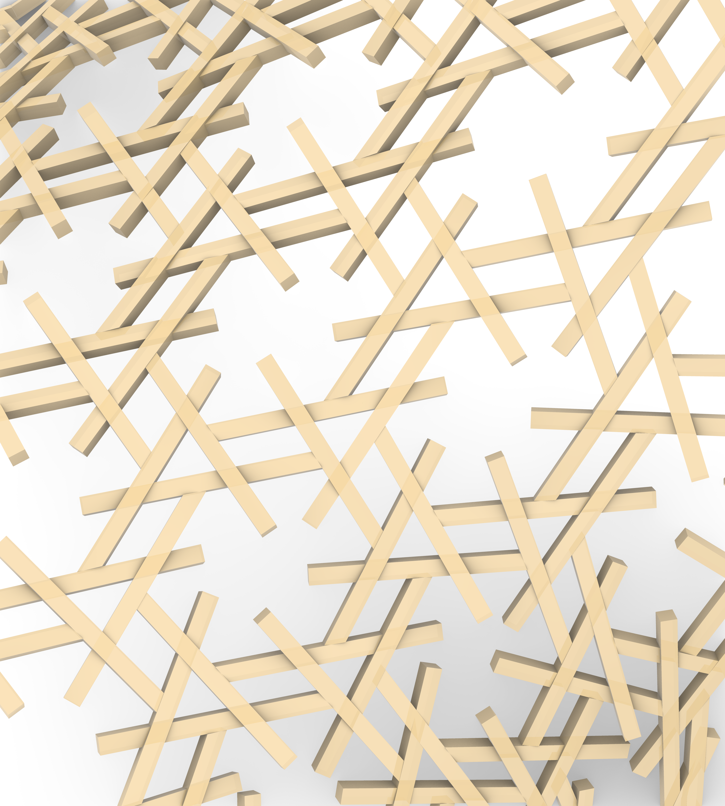
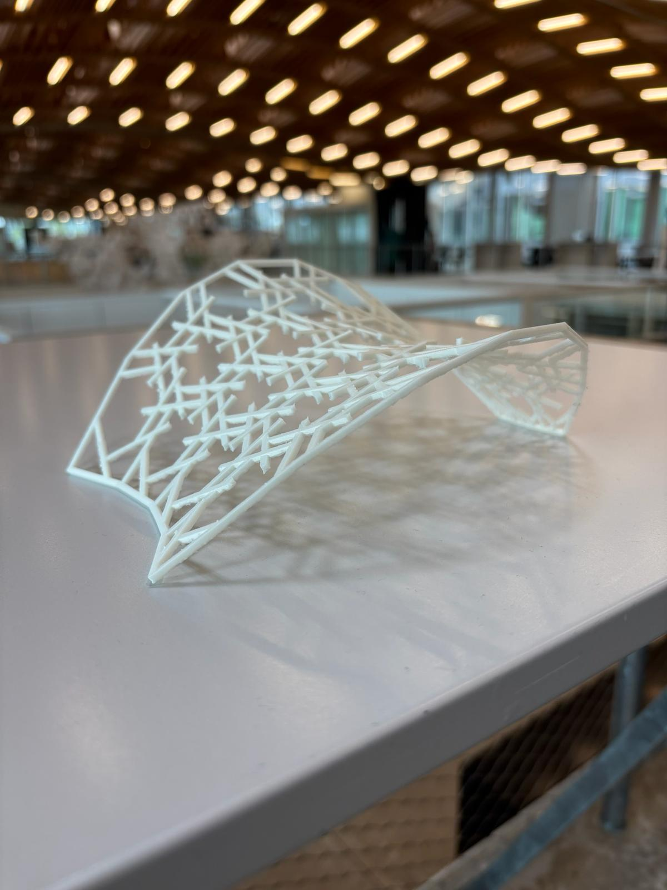
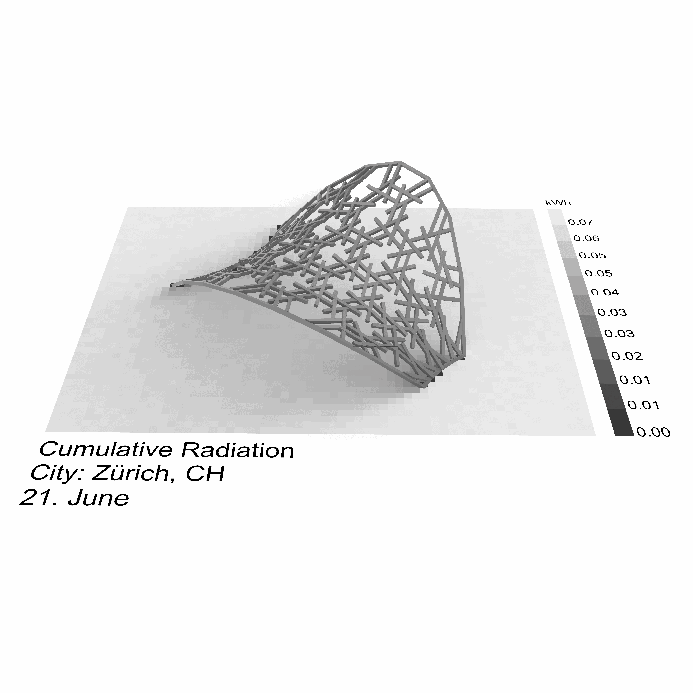

# A03 Design Project - Reciprocal Frame Timber Structure


## Project Overview

This project explores computational design and fabrication of reciprocal frame (RF) timber structures using COMPAS framework. The work combines mesh-based geometry generation, advanced RF transformations, and automated timber joinery design.

---

## Workshop Groups

Each group reads from the previous group's folder and writes its output into its own:

[group_a](group_a/) → [group_b](group_b/) → [group_c](group_c/) → [group_d](group_d/)

Add your name to your group's README.

---

## Table of Contents

1. [Core Systems](#core-systems)
2. [Key Innovations](#key-innovations)
3. [Technical Challenges & Solutions](#technical-challenges--solutions)
4. [Project Evolution](#project-evolution)
5. [File Structure](#file-structure)
6. [Usage Guide](#usage-guide)
7. [Results](#results)

---

## Core Systems



### 1. RF System Architecture

#### **Standard RF System** (`a03_rf_system.py`)
- Base reciprocal frame implementation
- Mesh-based edge representation
- Centerline computation and storage
- Edge normal calculation (averaged for interior edges)
- RF topology tracking (next_edge/prev_edge relationships)
- Eccentricity transformations:
  - Uniform eccentricity
  - Attractor point-based
  - Attractor curve-based
- Centerline extension with boundary trimming
- Spring force optimization for alignment

#### **Advanced RF System** (`a03_rf_system_timo.py`)
- Extended RF system with advanced transformations
- **Hexagonal pattern generation**:
  - `eccentrize_centerlines_hexagonal()`: Creates hexagonal voids through rotation and offset
  - `eccentrize_centerlines_hexagonal_uv()`: UV-based hexagonal patterns following RF topology
- **Parametric eccentricity**: Separate control for u_start, u_end, v_start, v_end
- **Smart centerline filtering**: Excludes quad closing edges from output
- **Relative extensions**: Extension as factor of edge length
- **Closing edge handling**: Special treatment for 4-vertex and 6-vertex face closing edges

#### **Hybrid RF System** (`a03_rf_system_hybrid.py`)
**Purpose**: Combine different RF processing approaches for interior vs boundary beams

**Key Features**:
- Dual mesh architecture: `inner_mesh` + `boundary_mesh`
- Separate processing pipelines for each mesh type
- Automatic edge categorization (boundary/interior)
- Combined mesh generation for unified timber model
- Edge normal enforcement for all edges

**Use Case**: Apply advanced transformations (hexagonal patterns) to interior beams while maintaining simple boundary beams for structural containment.

---

### 2. Timber Model Generation

#### **Category-Based Timber Model** (`a03_timber_model.py`)
- Uses `CategoryRule` for tolerance-based joint matching
- Multiple tolerance passes (base, 1.5×, 2×) to catch beams at different distances
- Joint types:
  - `XLapJoint`: Interior-interior crossings
  - `TButtJoint`: Interior-boundary connections
  - `LMiterJoint`: Boundary-boundary corners
- Topology rules for additional X-joint detection
- Beam categorization system (boundary/interior)

#### **Geometric Timber Model** (`a03_timber_model_geometric.py`)
**Major Innovation**: Topology-aware joint generation using COMPAS Timber's `ConnectionSolver`

**Process**:
1. **Topology Detection**: Uses `ConnectionSolver.find_topology()` to detect actual beam relationships:
   - `TOPO_L`: Both beams meet at ends (L-shaped)
   - `TOPO_T`: One beam ends on another (T-shaped)
   - `TOPO_X`: Both beams cross (X-shaped)
   - `TOPO_I`: Parallel end-to-end

2. **Joint Assignment**:
   - `TOPO_L` + boundary-boundary → `LMiterJoint`
   - `TOPO_T` + any → `TButtJoint` (with correct beam order from solver)
   - `TOPO_X` + any → `XLapJoint` (boundary beam first if present)

3. **Priority System**:
   - Boundary beams maintain priority in all joint types
   - For `TButtJoint`: continuous beam (main) stays intact, ending beam (cross) gets cut
   - For `XLapJoint`: boundary beam on top when present

**Results**: 
- 0 topology errors (vs 250+ with previous approaches)
- 374 successful joints from 401 detected intersections
- 22 LMiterJoints, 223 TButtJoints, 129 XLapJoints

---

## Key Innovations

### 1. Hybrid RF System
**Problem**: Need different processing for interior vs boundary beams
**Solution**: Dual-mesh architecture allowing separate transformation pipelines
**Impact**: Enables complex interior patterns while maintaining structural boundary

### 2. Topology-Aware Joinery
**Problem**: DirectRule requires exact geometric topology, causing 250+ errors
**Solution**: Use `ConnectionSolver.find_topology()` to detect actual beam relationships
**Impact**: 100% success rate in joint creation (0 topology errors)

### 3. Hexagonal Pattern Generation
**Innovation**: Two methods for creating hexagonal voids:
- Rotation-based: Offset perpendicular to edge direction with rotation
- UV-based: Follow RF topology (prev_edge/next_edge) for natural patterns

### 4. Smart Edge Filtering
**Problem**: Quad closing edges create unwanted beams
**Solution**: Detect and filter closing edges based on face vertex ordering
**Impact**: Clean geometry with only structural beams

---

## Technical Challenges & Solutions

### Challenge 1: Topology Errors in Timber Joinery
**Initial Approach**: Used `DirectRule` with beam pairs detected by proximity
**Problem**: 
- 250+ "The cluster topology must be: TOPO_X for XLapJoint" errors
- 217+ "Beam roles must be reversed for TButtJoint" errors

**Root Cause**: 
- Proximity detection doesn't guarantee correct geometric topology
- Beam ordering didn't match what joint types expected

**Solution Evolution**:
1. ❌ Multiple tolerance passes → Made it worse
2. ❌ Category rules with fallbacks → Still had topology mismatches  
3. ❌ Manual topology assignment → Couldn't predict actual geometry
4. ✅ **Use `ConnectionSolver.find_topology()`** → Detects actual beam relationships
5. ✅ **Match joint types to detected topology** → 100% success rate

**Final Implementation**:
```python
# Detect actual topology
result = solver.find_topology(beam_a, beam_b, max_distance=tolerance)
topology = result.topology
main_beam = result.beam_a
cross_beam = result.beam_b

# Assign joint based on detected topology
if topology == JointTopology.TOPO_T:
    return TButtJoint, [main_beam, cross_beam]  # Solver provides correct order
elif topology == JointTopology.TOPO_X:
    return XLapJoint, [boundary_beam, interior_beam]  # Priority-based order
```

### Challenge 2: Boundary Beam Priority
**Requirement**: Boundary beams should never be cut, interior beams adjust to them
**Solution**: 
- For T-joints: Boundary beam is always the continuous (main) beam
- For X-joints: Boundary beam goes first in beam list (on top)
- For L-joints: Only boundary-boundary get LMiterJoint

### Challenge 3: Mesh Serialization
**Problem**: Pickle can't serialize dynamically loaded classes in Grasshopper
**Attempted Solutions**:
1. ❌ Direct pickle of RF system → Class identity mismatch
2. ❌ COMPAS `to_data()`/`from_data()` → Methods don't exist on Mesh
3. ⚠️ Extract and pickle meshes only → Works but incomplete

**Lesson**: Grasshopper's dynamic module loading breaks standard Python serialization

### Challenge 4: Edge Normal Computation
**Problem**: Boundary edges had `None` normals, causing beam creation failures
**Solution**: 
- Compute normals for ALL edges (not just interior)
- For boundary edges: use single adjacent face normal
- For interior edges: average of two adjacent face normals
- Fallback to Z-up vector if no faces available

---

## Project Evolution

### Phase 1: Basic RF System
- Implemented standard reciprocal frame with mesh-based edges
- Centerline computation and storage
- Basic eccentricity transformations

### Phase 2: Advanced Transformations
- Attractor-based eccentricity (point and curve)
- Hexagonal pattern generation
- Parametric UV control
- Spring force optimization

### Phase 3: Hybrid System Development
- Dual-mesh architecture
- Separate processing for interior/boundary
- Edge categorization system
- Combined mesh generation

### Phase 4: Timber Joinery (Major Challenge)
**Iteration 1**: Category rules with multiple tolerances
- Result: 119 XLapJoints, 29 TButtJoints, 22 LMiterJoints
- Problem: 240+ unjoined clusters

**Iteration 2**: Direct rules from RF topology
- Result: Only 26 rules created, 402 unjoined
- Problem: Not all beams have RF topology

**Iteration 3**: Geometric intersection detection
- Result: Found 787 intersections
- Problem: Still topology errors (wrong joint types for geometry)

**Iteration 4**: Topology-aware with ConnectionSolver ✅
- Result: 374 joints, 0 errors
- Success: Matches joint types to actual beam geometry

### Phase 5: Refinement & Documentation
- Edge filtering for clean geometry
- Comprehensive error handling
- Performance optimization
- Documentation and examples

---

## File Structure

### Core Python Modules
```
code/
├── a03_rf_system.py              # Base RF system
├── a03_rf_system_timo.py         # Advanced RF with hexagonal patterns
├── a03_rf_system_hybrid.py       # Hybrid dual-mesh system
├── a03_rf_from_lines.py          # Build RF from input line geometry
├── a03_rf_from_lines_simple.py   # Simplified RF-from-lines variant
├── a03_timber_model.py           # Category-based timber model
├── a03_timber_model_geometric.py # Topology-aware timber model ⭐
├── a03_mesher.py                 # Mesh generation utilities
├── a03_modifiers.py              # Mesh modification tools
└── a03_mesh_relax.py             # Mesh relaxation algorithms
```

### Extras (analysis & fabrication)
```
code/
├── a03_extra_3d_printing.py            # 3D printing export
├── a03_extra_packing_stats.py          # Beam packing statistics
├── a03_extra_structural_analysis.py    # Structural analysis script
├── a03_extra_structural_analysis.ghx   # Structural analysis Grasshopper definition
└── a03_extra_toolpath.py               # CNC toolpath generation
```

### Grasshopper Components
```
gh_compont_scripts/
├── gh_rf_from_centerlines.py       # Build RF system from centerlines
├── gh_load_rf_system.py            # Load serialized RF system
├── gh_save_rf_system.py            # Save RF system
└── gh_compas_to_rhino_geometry.py  # COMPAS → Rhino geometry conversion
```

### Grasshopper Definitions
```
code/final_hexmesh.ghx              # Main design file with hexagonal patterns
```

### Design Outputs
```
design/
├── shape.3dm                      # Rhino source file
├── stats_final_hexmesh.png        # Packing statistics
└── structural_final_hexmesh.png   # Structural analysis
```

### Timber Models
```
timber_models/
└── timbermodel_final_hexmesh.json   # Final design with 374 joints
```

### Documents
```
poster.pdf          # Project poster
presentation.pdf    # Project presentation
```

---

## Usage Guide

### 1. Creating a Hybrid RF System

```python
from a03_rf_system import RFSystem
from a03_rf_system_timo import RFSystem as RFSystemTimo
from a03_rf_system_hybrid import RFSystemHybrid

# Create inner mesh with advanced transformations
inner_rf = RFSystemTimo(inner_mesh)
inner_rf.create_rf_datastructure()
inner_rf.eccentrize_centerlines_hexagonal_uv(offset=0.05)
inner_rf.extend_centerlines(extensions_pos=0.1, extensions_neg=0.1)

# Create boundary mesh with standard processing
boundary_rf = RFSystem(boundary_mesh)
boundary_rf.create_rf_datastructure()
boundary_rf.extend_centerlines(extension=0.1)

# Combine into hybrid system
hybrid_rf = RFSystemHybrid(inner_rf.mesh, boundary_rf.mesh)
```

### 2. Generating Timber Model with Topology-Aware Joinery

```python
from a03_timber_model_geometric import GeometricTimberModelCreator

# Create timber model with automatic topology detection
creator = GeometricTimberModelCreator(
    rf_system=hybrid_rf,
    beam_width=0.08,
    beam_height=0.10,
    sampling_points=20  # Centerline sampling density
)

# Generate model with joinery
timber_model = creator.create_timber_model(process_joinery=True)

# Results
print(f"Joints created: {len(timber_model.joints)}")
print(f"Joining errors: {len(creator.joining_errors)}")
```

### 3. Hexagonal Pattern Generation

```python
# Method 1: Rotation-based hexagonal pattern
rf_system.eccentrize_centerlines_hexagonal(
    offset=0.05,           # Offset distance
    rotation_angle=60.0    # Rotation for hexagonal geometry
)

# Method 2: UV-based hexagonal pattern (follows RF topology)
rf_system.eccentrize_centerlines_hexagonal_uv(
    offset=0.05,
    u_offset=0.05,  # Offset in prev_edge direction
    v_offset=0.05   # Offset in next_edge direction
)
```

---

## Results

### Final Design: Hexagonal Mesh Structure



**Geometry**:
- 182 beams (160 interior + 22 boundary)
- 374 joints (0 errors)
  - 22 LMiterJoints (boundary corners)
  - 223 TButtJoints (interior-boundary connections)
  - 129 XLapJoints (interior crossings)
- 27 unjoined clusters (interior L-joints, intentionally skipped)

**Topology Detection Results**:
- 49 TOPO_L intersections detected
- 223 TOPO_T intersections detected
- 129 TOPO_X intersections detected
- 401 total valid intersections

**Performance**:
- 100% joint creation success rate
- 0 topology errors
- Boundary beams maintain structural priority
- Interior beams create hexagonal voids

### Key Achievements

1. ✅ **Hybrid RF System**: Successfully combined different processing approaches
2. ✅ **Topology-Aware Joinery**: Eliminated all topology errors through proper detection
3. ✅ **Hexagonal Patterns**: Created complex interior geometry while maintaining boundaries
4. ✅ **Automated Fabrication**: Generated BTL files for CNC machining

### Assembly Sequence


### Environmental Analysis



---

## Technical Stack

- **COMPAS Framework**: Computational design and geometry
- **COMPAS Timber**: Timber joinery and fabrication
- **Grasshopper/Rhino**: Visual programming and 3D modeling
- **Python 3.x**: Core programming language

---

## Lessons Learned

### 1. Topology Matters
Proximity-based joint detection is insufficient. Actual geometric topology must be detected and matched to joint types.

### 2. Solver Integration
Using COMPAS Timber's built-in `ConnectionSolver` provides reliable topology detection that matches the framework's expectations.

### 3. Beam Priority
Clear hierarchy (boundary > interior) must be enforced at the joint creation level, not just through beam ordering.

### 4. Iterative Development
Complex systems require multiple iterations. The final topology-aware solution came after 4 major iterations of the joinery system.

### 5. Documentation
Comprehensive documentation of challenges and solutions is crucial for understanding design decisions.

---

## Future Work

1. **Serialization**: Implement proper RF system save/load using COMPAS data structures
2. **Optimization**: Automated parameter optimization for hexagonal patterns
3. **Structural Analysis**: Integration with FEA for load-bearing verification
4. **Fabrication**: Direct integration with robotic fabrication systems
5. **Parametric Exploration**: Automated design space exploration

---

## Credits

* **Project**: A03 Design Project - Coding Architecture FS26
* **Institution**: ETH Zurich
* **Framework**: COMPAS (https://compas.dev)
* **Development**: Iterative problem-solving with AI assistance (Bob/Claude)

---

## License

Released under the MIT License, see [LICENSE](LICENSE). Copyright © 2026 Gramazio Kohler Research, ETH Zürich.
